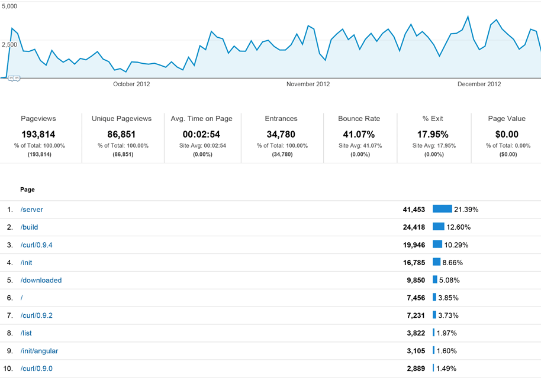

# Insight [](http://travis-ci.org/yeoman/insight)

> Understand how your tool is being used by anonymously reporting usage metrics to [Google Analytics](http://www.google.com/analytics/)
or [Yandex.Metrica](http://metrica.yandex.com/)


## Install

```
$ npm install --save insight
```


## Access data / generate dashboards

### Google Analytics (GA)

- Use [Embed API](https://developers.google.com/analytics/devguides/reporting/embed/v1/) to embed charts
- Use [Core Reporting API](https://developers.google.com/analytics/devguides/reporting/core/v3/) or [Real Time Reporting API](https://developers.google.com/analytics/devguides/reporting/realtime/v3/) to access raw data, then build custom visualization, e.g. [metrics from Bower](http://bower.io/stats/)
- Use GA's dashboards directly, e.g. metrics from [Yeoman](http://yeoman.io):




## Provider Setup

### Google Analytics (GA)

Currently Insight should to be used with GA set up as web tracking due to use of URLs. Future plan include refactoring to work with GA set up for app-based tracking and the [Measurement Protocol](https://developers.google.com/analytics/devguides/collection/protocol/v1/).

For debugging, Insight can track OS version, node version and version of the app that implements Insight. Please set up custom dimensions per below screenshot. This is a temporary solution until Insight is refactored into app-based tracking.


## Collected Data

Insight cares deeply about the security of your user's data, and strives to be fully transparent with what it tracks. All data is sent via HTTPS secure connections. Insight provides API to offer an easy way for users to opt-out at any time.

Below is what Insight is capable of tracking. Individual implementation can choose to not track some items.

- The version of the module that implements Insight
- Module commands (e.g. install / search)
- Name and version of packages involved with command used
- Version of node.js & OS for developer debugging
- A random & absolutely anonymous ID


## Usage

### Google Analytics

```js
var Insight = require('insight');
var pkg = require('./package.json');

var insight = new Insight({
	// Google Analytics tracking code
	trackingCode: 'UA-XXXXXXXX-X',
	pkg: pkg
});

// ask for permission the first time
if (insight.optOut === undefined) {
	return insight.askPermission();
}

insight.track('foo', 'bar');
// recorded in Analytics as `/foo/bar`
```

### Yandex.Metrica

```js
var Insight = require('insight');
var pkg = require('./package.json');

var insight = new Insight({
	// Yandex.Metrica counter id
	trackingCode: 'XXXXXXXXX'
	trackingProvider: 'yandex',
	pkg: pkg
});

// ask for permission the first time
if (insight.optOut === undefined) {
	return insight.askPermission();
}

insight.track('foo', 'bar');
// recorded in Yandex.Metrica as `http://<package-name>.insight/foo/bar`
```


## API

### Insight(settings)

#### trackingCode

**Required**  
Type: `string`

Your Google Analytics [trackingCode](https://support.google.com/analytics/bin/answer.py?hl=en&answer=1008080) or Yandex.Metrica [counter id](http://help.yandex.com/metrika/?id=1121963).

#### trackingProvider

Type: `string`  
Default: `'google'`
Values: `'google'`, `'yandex'`

Tracking provider to use.

#### pkg

##### name

**Required**  
Type: `string`

##### version

Type: `string`  
Default: `'undefined'`

#### config

Type: `object`  
Default: An instance of [`configstore`](https://github.com/yeoman/configstore)

If you want to use your own configuration mechanism instead of the default
`configstore`-based one, you can provide an object that has to implement two
synchronous methods:

- `get(key)`
- `set(key, value)`


### Instance methods

#### .track(keyword, [keyword, ...])

Accepts keywords which ends up as a path in Analytics.

`.track('init', 'backbone')` becomes `/init/backbone`

#### .askPermission([message, callback])

Asks the user permission to opt-in to tracking and sets the `optOut` property in `config`. You can also choose to set `optOut` property in `config` manually.


Optionally supply your own `message` and `callback`. If `message` is `null`, default message will be used. The callback will be called with the arguments `error` and `optIn` when the prompt is done, and is useful for when you want to continue the execution while the prompt is running.


#### .optOut

Returns a boolean whether the user has opted out of tracking. Should preferably only be set by a user action, eg. a prompt.


## License

BSD-2-Clause © Google
